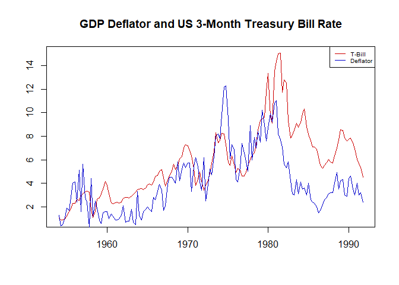
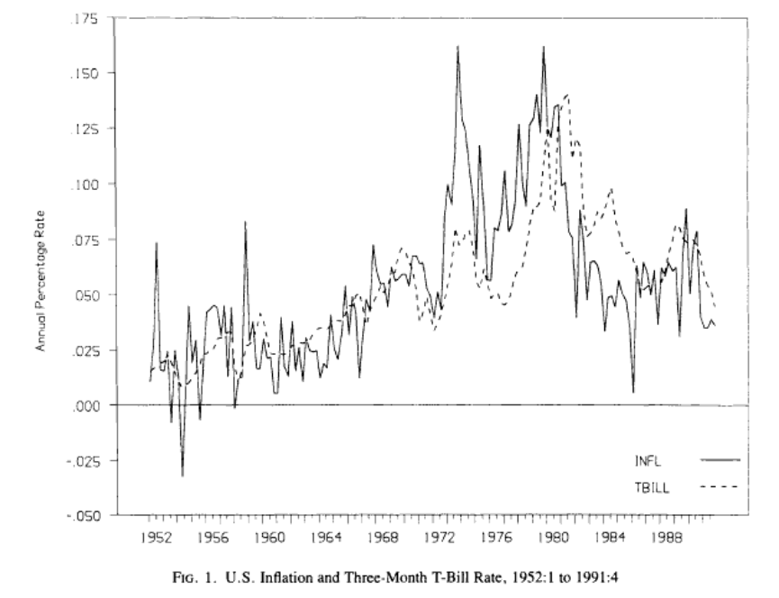
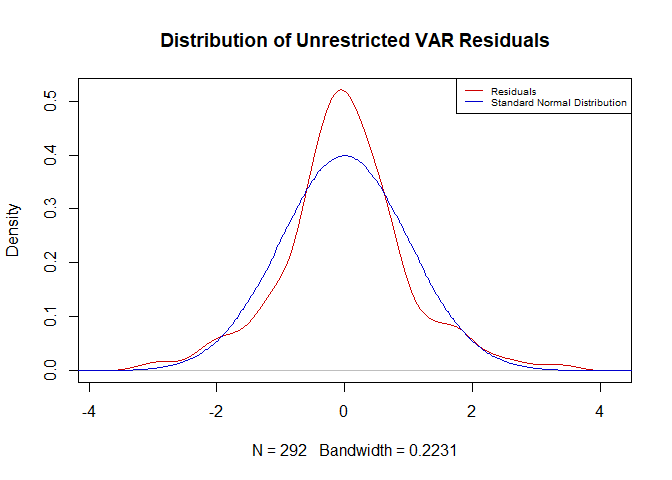
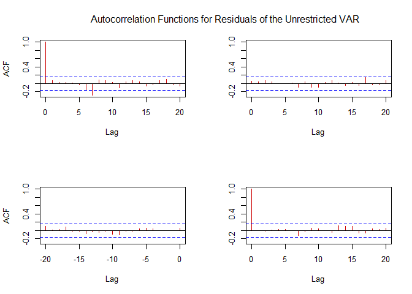
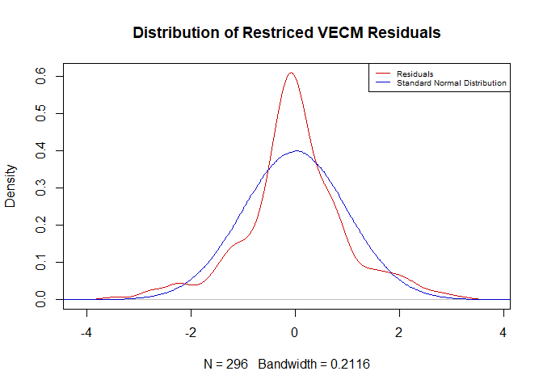
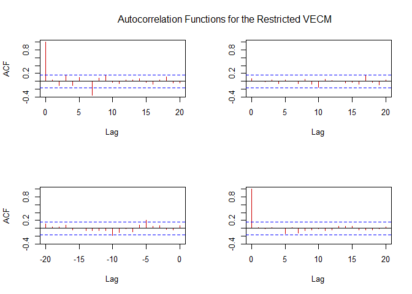
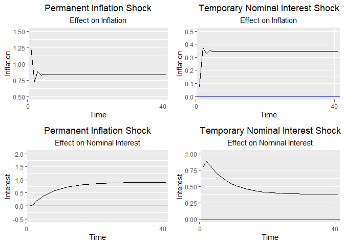
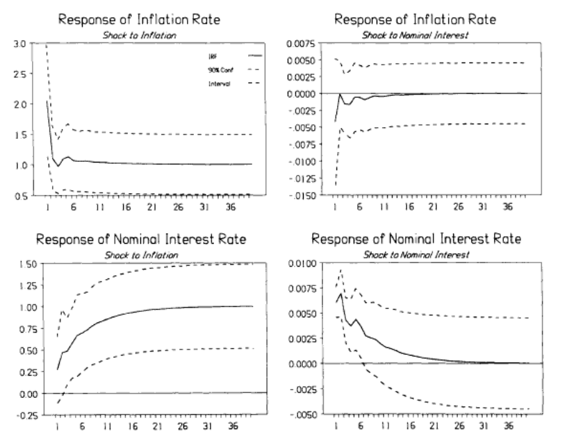
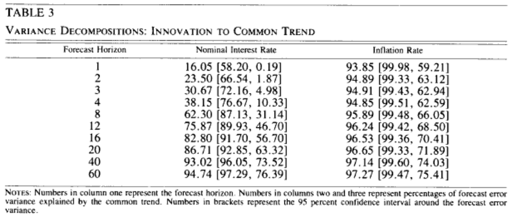
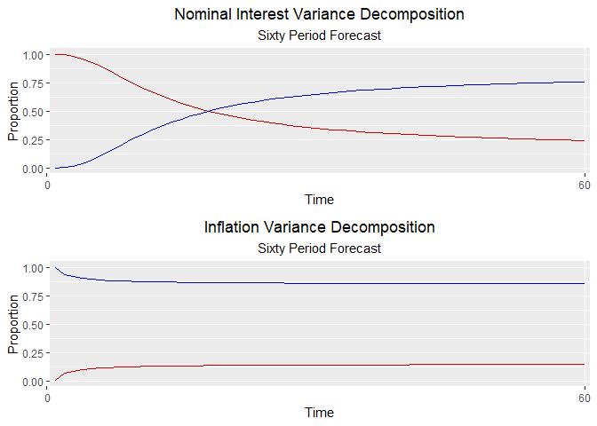

# Required Packages:

-   pacman

-   tidyverse

-   lubridate

-   gridExtra

-   moments

-   seasonal

-   tseries

-   vars

-   lmtest

-   urca

-   tsDyn

-   ggplot2

-   base R is largely used.

# Data Wrangling

``` r
# Data wrangling. (tidyverse)

TData <- read.csv("Data/TBillData.csv") %>% # load

         rename(TBillRate = DTB3) %>% # renaming column 

         subset(
           
           DATE < "2023-01-01" & 
             
           DATE <= "1991-10-01") # making vectors equal length


InfData <- read.csv("Data/PriceDeflator(SAdjust).csv") %>% # load
 
         subset(
           
           DATE >= "1954-01-01" & 
             
           DATE <= "1991-10-01") %>% # only after 1954

         rename(Deflator = A191RI1Q225SBEA) # rename column

###

TData_ts <- ts(TData$TBillRate, 
               
               start = c(year(TData$DATE[1]), 
                         
                         quarter(TData$DATE[1])),
               
               frequency = 4) # convert to ts

decomp <- decompose(TData_ts) # Perform seasonal decomposition on data.

TData_ts <- TData_ts - decomp$seasonal #seasonally adjust 

rm(decomp)

###

InfData_ts <- ts(InfData$Deflator, 
               start = c(year(InfData$DATE[1]), 
                         
                         quarter(InfData$DATE[1])),
               
               frequency = 4)

# At this point, R interprets the data as Time series, seasonally adjusted, vectors of equal length, indexed by recognizable date columns. This means I can begin doing actual tests. 

# For Johansen: 

# Step 1: check that all variables are I(1). [y] 
# Step 2: Unrestricted VAR. Test whether white noise errors. [n]
# Step 3: Estimate specific VECM, do trace and max eigenvalue tests. 
# Step 4: Impose r, reduced rank regression. 
# Step 5: forecasts; model adequacy. 
```

# Data Plotting and Comparison

``` r
plot(TData_ts, main = "GDP Deflator and US 3-Month Treasury Bill Rate",
               xlab = "",
               ylab = "",
               col = "red3")
lines(InfData_ts, 
      col = "blue3")
legend("topright",
       c("T-Bill", "Deflator"), 
       col = c("red3", "blue3"), 
       lty = 1,
       cex = 0.6)
```



``` r
# must compare this with graph from their actual paper. 
```

``` r
# Comparing with original paper. 

knitr::include_graphics("Images/FirstPlot.png", 
                         dpi = 300)
```



# Formal Dickey-Fuller tests for a Unit Root

``` r
adf11 <- adf.test(InfData_ts) # non-stationary (p-values)
adf1 <- ur.df(InfData_ts, type = "trend", selectlags = "AIC")

adf22 <- adf.test(TData_ts) # non-stationary (p-values)
adf2 <- ur.df(TData_ts, type = "trend", selectlags = "AIC")

summary(adf1) # Test statistic -2.3007 > all significance levels. 
```

    ## 
    ## ############################################### 
    ## # Augmented Dickey-Fuller Test Unit Root Test # 
    ## ############################################### 
    ## 
    ## Test regression trend 
    ## 
    ## 
    ## Call:
    ## lm(formula = z.diff ~ z.lag.1 + 1 + tt + z.diff.lag)
    ## 
    ## Residuals:
    ##     Min      1Q  Median      3Q     Max 
    ## -3.7351 -0.8591 -0.0366  0.6612  3.6968 
    ## 
    ## Coefficients:
    ##               Estimate Std. Error t value Pr(>|t|)    
    ## (Intercept)  0.4001398  0.2375302   1.685   0.0942 .  
    ## z.lag.1     -0.1020887  0.0443721  -2.301   0.0228 *  
    ## tt           0.0005475  0.0026440   0.207   0.8362    
    ## z.diff.lag  -0.3269138  0.0784998  -4.165 5.31e-05 ***
    ## ---
    ## Signif. codes:  0 '***' 0.001 '**' 0.01 '*' 0.05 '.' 0.1 ' ' 1
    ## 
    ## Residual standard error: 1.287 on 146 degrees of freedom
    ## Multiple R-squared:  0.1756, Adjusted R-squared:  0.1587 
    ## F-statistic: 10.37 on 3 and 146 DF,  p-value: 3.164e-06
    ## 
    ## 
    ## Value of test-statistic is: -2.3007 1.9698 2.9399 
    ## 
    ## Critical values for test statistics: 
    ##       1pct  5pct 10pct
    ## tau3 -3.99 -3.43 -3.13
    ## phi2  6.22  4.75  4.07
    ## phi3  8.43  6.49  5.47

``` r
adf11 # p value = 0.5384
```

    ## 
    ##  Augmented Dickey-Fuller Test
    ## 
    ## data:  InfData_ts
    ## Dickey-Fuller = -2.0911, Lag order = 5, p-value = 0.5384
    ## alternative hypothesis: stationary

``` r
summary(adf2) # Test Statistic -2.6581 > all significant values. 
```

    ## 
    ## ############################################### 
    ## # Augmented Dickey-Fuller Test Unit Root Test # 
    ## ############################################### 
    ## 
    ## Test regression trend 
    ## 
    ## 
    ## Call:
    ## lm(formula = z.diff ~ z.lag.1 + 1 + tt + z.diff.lag)
    ## 
    ## Residuals:
    ##     Min      1Q  Median      3Q     Max 
    ## -3.3804 -0.3062  0.0001  0.3740  4.7582 
    ## 
    ## Coefficients:
    ##              Estimate Std. Error t value Pr(>|t|)   
    ## (Intercept)  0.297745   0.151612   1.964  0.05145 . 
    ## z.lag.1     -0.090213   0.033939  -2.658  0.00873 **
    ## tt           0.003132   0.002312   1.355  0.17761   
    ## z.diff.lag   0.229472   0.082113   2.795  0.00589 **
    ## ---
    ## Signif. codes:  0 '***' 0.001 '**' 0.01 '*' 0.05 '.' 0.1 ' ' 1
    ## 
    ## Residual standard error: 0.8253 on 146 degrees of freedom
    ## Multiple R-squared:  0.08255,    Adjusted R-squared:  0.06369 
    ## F-statistic: 4.379 on 3 and 146 DF,  p-value: 0.005532
    ## 
    ## 
    ## Value of test-statistic is: -2.6581 2.6508 3.9376 
    ## 
    ## Critical values for test statistics: 
    ##       1pct  5pct 10pct
    ## tau3 -3.99 -3.43 -3.13
    ## phi2  6.22  4.75  4.07
    ## phi3  8.43  6.49  5.47

``` r
adf22 # p value = 0.1468
```

    ## 
    ##  Augmented Dickey-Fuller Test
    ## 
    ## data:  TData_ts
    ## Dickey-Fuller = -3.0309, Lag order = 5, p-value = 0.1468
    ## alternative hypothesis: stationary

``` r
# speak about how dickey fuller tests have weak power at these sort of boundary values, maybe this is why the paper added MA terms (even if I do not really think it is necessary). 
```

# Vector Autoregression and Tests for White Noise Errors

``` r
# unrestricted VAR (NB)

Interest <- (TData_ts - mean(TData_ts)) # de-mean both
Inflation <- (InfData_ts - mean(InfData_ts))

VARdata <- cbind(Interest, Inflation)
Var <- VAR(VARdata, p = 6, type = "const")
serial.test(Var) # autocorrelation is not present. 
```

    ## 
    ##  Portmanteau Test (asymptotic)
    ## 
    ## data:  Residuals of VAR object Var
    ## Chi-squared = 43.438, df = 40, p-value = 0.3271

``` r
###

resids <- resid(Var)

StdResid <- (resids - mean(resids))/sd(resids) # standardise for comparison

ActNorm <- rnorm(1000000)

kurtosis(StdResid) # Inflation normal, T-Bill is leptokurtic (extremes).
```

    ##  Interest Inflation 
    ##  5.676567  3.214704

``` r
# this can easily lead to biased estimates and incorrect inference. 

mean(resids) # basically zero. 
```

    ## [1] -6.428353e-18

``` r
plot(density(StdResid), 
     main = "Distribution of Unrestricted VAR Residuals", 
     col = "red3")
lines(density(ActNorm), 
      col = "blue3")
legend("topright",
       c("Residuals", "Standard Normal Distribution"),
       col = c("red3", "blue3"),
       lty = 1, 
        cex = 0.6)
```



``` r
# mean zero
# Speak about how Kurtosis affects Maximum Likelihood estimations.
```



# Vector Error Correction Mechanism and Eigenvalue Tests

## Trace and Maximum Eigenvalue Tests

``` r
# lag length 4. 

# First specification; (H1r) allows for deterministic trends in the data. 

# Second specification; (H1*r)allows for a non-zero mean of the equilibrium relationship, but does not allow for deterministic trends. 

# Third specification; (H0r) restricts the mean of the relationship to zero.

# Essentially, now just test whether there is at least one co-integrating relationship. 

#Specification 1: 

Johansen11 <- ca.jo(VARdata, 
                    type="trace", 
                    ecdet="trend", 
                    K=2)

urca::summary(Johansen11) # There is at least one... 
```

    ## 
    ## ###################### 
    ## # Johansen-Procedure # 
    ## ###################### 
    ## 
    ## Test type: trace statistic , with linear trend in cointegration 
    ## 
    ## Eigenvalues (lambda):
    ## [1] 1.225568e-01 4.500295e-02 4.163336e-17
    ## 
    ## Values of teststatistic and critical values of test:
    ## 
    ##           test 10pct  5pct  1pct
    ## r <= 1 |  6.91 10.49 12.25 16.26
    ## r = 0  | 26.52 22.76 25.32 30.45
    ## 
    ## Eigenvectors, normalised to first column:
    ## (These are the cointegration relations)
    ## 
    ##              Interest.l2 Inflation.l2   trend.l2
    ## Interest.l2   1.00000000   1.00000000  1.0000000
    ## Inflation.l2 -0.75843036   1.68610292  0.0484579
    ## trend.l2     -0.02538502  -0.05233336 -0.1840203
    ## 
    ## Weights W:
    ## (This is the loading matrix)
    ## 
    ##             Interest.l2 Inflation.l2     trend.l2
    ## Interest.d  -0.16991571 -0.007336499 7.173195e-18
    ## Inflation.d  0.05572192 -0.045839688 4.929899e-17

``` r
Johansen12 <- ca.jo(VARdata, 
                    type="eigen", 
                    ecdet="trend", 
                    K=2)

summary(Johansen12) # At least one... 
```

    ## 
    ## ###################### 
    ## # Johansen-Procedure # 
    ## ###################### 
    ## 
    ## Test type: maximal eigenvalue statistic (lambda max) , with linear trend in cointegration 
    ## 
    ## Eigenvalues (lambda):
    ## [1] 1.225568e-01 4.500295e-02 4.163336e-17
    ## 
    ## Values of teststatistic and critical values of test:
    ## 
    ##           test 10pct  5pct  1pct
    ## r <= 1 |  6.91 10.49 12.25 16.26
    ## r = 0  | 19.61 16.85 18.96 23.65
    ## 
    ## Eigenvectors, normalised to first column:
    ## (These are the cointegration relations)
    ## 
    ##              Interest.l2 Inflation.l2   trend.l2
    ## Interest.l2   1.00000000   1.00000000  1.0000000
    ## Inflation.l2 -0.75843036   1.68610292  0.0484579
    ## trend.l2     -0.02538502  -0.05233336 -0.1840203
    ## 
    ## Weights W:
    ## (This is the loading matrix)
    ## 
    ##             Interest.l2 Inflation.l2     trend.l2
    ## Interest.d  -0.16991571 -0.007336499 7.173195e-18
    ## Inflation.d  0.05572192 -0.045839688 4.929899e-17

``` r
### At 95% level there is at least one co-integrating relationship. 

#Specification 2: [this one won]

Johansen21 <- ca.jo(VARdata, 
                    type="trace", 
                    ecdet="const", 
                    K=2)

summary(Johansen21) # There is at least one... 
```

    ## 
    ## ###################### 
    ## # Johansen-Procedure # 
    ## ###################### 
    ## 
    ## Test type: trace statistic , without linear trend and constant in cointegration 
    ## 
    ## Eigenvalues (lambda):
    ## [1] 1.011380e-01 4.086605e-02 1.804112e-16
    ## 
    ## Values of teststatistic and critical values of test:
    ## 
    ##           test 10pct  5pct  1pct
    ## r <= 1 |  6.26  7.52  9.24 12.97
    ## r = 0  | 22.25 17.85 19.96 24.60
    ## 
    ## Eigenvectors, normalised to first column:
    ## (These are the cointegration relations)
    ## 
    ##              Interest.l2 Inflation.l2   constant
    ## Interest.l2    1.0000000    1.0000000  1.0000000
    ## Inflation.l2  -1.0828670    1.5373443 -0.3312269
    ## constant      -0.1450805   -0.4816212 27.1747936
    ## 
    ## Weights W:
    ## (This is the loading matrix)
    ## 
    ##             Interest.l2 Inflation.l2      constant
    ## Interest.d  -0.10766108  -0.00976472 -4.911850e-19
    ## Inflation.d  0.05997545  -0.03755491 -5.155019e-18

``` r
Johansen22 <- ca.jo(VARdata, 
                    type="eigen", 
                    ecdet="const", 
                    K=2)

summary(Johansen22) # barely at 95% level but there is 1. 
```

    ## 
    ## ###################### 
    ## # Johansen-Procedure # 
    ## ###################### 
    ## 
    ## Test type: maximal eigenvalue statistic (lambda max) , without linear trend and constant in cointegration 
    ## 
    ## Eigenvalues (lambda):
    ## [1] 1.011380e-01 4.086605e-02 1.804112e-16
    ## 
    ## Values of teststatistic and critical values of test:
    ## 
    ##           test 10pct  5pct  1pct
    ## r <= 1 |  6.26  7.52  9.24 12.97
    ## r = 0  | 15.99 13.75 15.67 20.20
    ## 
    ## Eigenvectors, normalised to first column:
    ## (These are the cointegration relations)
    ## 
    ##              Interest.l2 Inflation.l2   constant
    ## Interest.l2    1.0000000    1.0000000  1.0000000
    ## Inflation.l2  -1.0828670    1.5373443 -0.3312269
    ## constant      -0.1450805   -0.4816212 27.1747936
    ## 
    ## Weights W:
    ## (This is the loading matrix)
    ## 
    ##             Interest.l2 Inflation.l2      constant
    ## Interest.d  -0.10766108  -0.00976472 -4.911850e-19
    ## Inflation.d  0.05997545  -0.03755491 -5.155019e-18

``` r
#Specification 3: 

Johansen31 <- ca.jo(VARdata, 
                    type="trace", 
                    ecdet="none", 
                    K=2)

summary(Johansen31) # 15.88 vs 15.94 very close actually. 
```

    ## 
    ## ###################### 
    ## # Johansen-Procedure # 
    ## ###################### 
    ## 
    ## Test type: trace statistic , with linear trend 
    ## 
    ## Eigenvalues (lambda):
    ## [1] 0.10081409 0.04069173
    ## 
    ## Values of teststatistic and critical values of test:
    ## 
    ##           test 10pct  5pct  1pct
    ## r <= 1 |  6.23  6.50  8.18 11.65
    ## r = 0  | 22.17 15.66 17.95 23.52
    ## 
    ## Eigenvectors, normalised to first column:
    ## (These are the cointegration relations)
    ## 
    ##              Interest.l2 Inflation.l2
    ## Interest.l2      1.00000     1.000000
    ## Inflation.l2    -1.08517     1.491662
    ## 
    ## Weights W:
    ## (This is the loading matrix)
    ## 
    ##             Interest.l2 Inflation.l2
    ## Interest.d  -0.10739175  -0.01003405
    ## Inflation.d  0.06058762  -0.03816709

``` r
Johansen32 <- ca.jo(VARdata, 
                    type="eigen", 
                    ecdet="none", 
                    K=2)

summary(Johansen32)
```

    ## 
    ## ###################### 
    ## # Johansen-Procedure # 
    ## ###################### 
    ## 
    ## Test type: maximal eigenvalue statistic (lambda max) , with linear trend 
    ## 
    ## Eigenvalues (lambda):
    ## [1] 0.10081409 0.04069173
    ## 
    ## Values of teststatistic and critical values of test:
    ## 
    ##           test 10pct  5pct  1pct
    ## r <= 1 |  6.23  6.50  8.18 11.65
    ## r = 0  | 15.94 12.91 14.90 19.19
    ## 
    ## Eigenvectors, normalised to first column:
    ## (These are the cointegration relations)
    ## 
    ##              Interest.l2 Inflation.l2
    ## Interest.l2      1.00000     1.000000
    ## Inflation.l2    -1.08517     1.491662
    ## 
    ## Weights W:
    ## (This is the loading matrix)
    ## 
    ##             Interest.l2 Inflation.l2
    ## Interest.d  -0.10739175  -0.01003405
    ## Inflation.d  0.06058762  -0.03816709

``` r
# All 3 tests indicate one co-integrating relationship between the variables.

# R automatically selects lags based on the AIC, so cannot fiddle to see how sensitive these results are. The authors claim that it is not very sensitive. 

# HOW DO I CHOOSE? How did they choose? 

rm(Johansen11,Johansen12, Johansen22, Johansen31, Johansen32) # housekeeping
```

## Imposing Restrictions and Estimating the Model

``` r
VECM1 <- VECM(VARdata, 1, r = 1, estim=("ML"))
summary(VECM1) # Parsimonious 
```

    ## #############
    ## ###Model VECM 
    ## #############
    ## Full sample size: 152    End sample size: 150
    ## Number of variables: 2   Number of estimated slope parameters 8
    ## AIC 16.60091     BIC 43.69663    SSR 329.622
    ## Cointegrating vector (estimated by ML):
    ##    Interest Inflation
    ## r1        1  -1.08517
    ## 
    ## 
    ##                    ECT                Intercept          Interest -1      
    ## Equation Interest  -0.1074(0.0288)*** 0.0197(0.0661)     0.2093(0.0785)** 
    ## Equation Inflation 0.0606(0.0451)     0.0072(0.1034)     0.3560(0.1228)** 
    ##                    Inflation -1      
    ## Equation Interest  -0.0857(0.0506).  
    ## Equation Inflation -0.3544(0.0792)***

``` r
# ECT of Inflation is insignificant. 

VECM2 <- VECM(VARdata, 2, r = 1, estim=("ML"))
summary(VECM2)
```

    ## #############
    ## ###Model VECM 
    ## #############
    ## Full sample size: 152    End sample size: 149
    ## Number of variables: 2   Number of estimated slope parameters 12
    ## AIC 6.051429     BIC 45.10273    SSR 315.0584
    ## Cointegrating vector (estimated by ML):
    ##    Interest Inflation
    ## r1        1 -1.310433
    ## 
    ## 
    ##                    ECT                Intercept          Interest -1      
    ## Equation Interest  -0.0695(0.0260)**  0.0256(0.0632)     0.2526(0.0757)** 
    ## Equation Inflation 0.0600(0.0427)     0.0101(0.1040)     0.3590(0.1246)** 
    ##                    Inflation -1       Interest -2        Inflation -2       
    ## Equation Interest  0.0089(0.0564)     -0.3332(0.0782)*** 0.1091(0.0518)*    
    ## Equation Inflation -0.3806(0.0928)*** 0.0004(0.1286)     -0.0839(0.0852)

``` r
# Less parsimonious, ECT of interest remains significant. 

VECM3 <- VECM(VARdata, 3, r = 1, estim=("ML"), include = "const")
summary(VECM3)
```

    ## #############
    ## ###Model VECM 
    ## #############
    ## Full sample size: 152    End sample size: 148
    ## Number of variables: 2   Number of estimated slope parameters 16
    ## AIC -2.680713    BIC 48.2719     SSR 296.9665
    ## Cointegrating vector (estimated by ML):
    ##    Interest  Inflation
    ## r1        1 -0.4047558
    ## 
    ## 
    ##                    ECT                 Intercept          Interest -1      
    ## Equation Interest  -0.0655(0.0276)*    0.0192(0.0618)     0.2919(0.0806)***
    ## Equation Inflation -0.0634(0.0459)     0.0102(0.1029)     0.5049(0.1343)***
    ##                    Inflation -1       Interest -2        Inflation -2      
    ## Equation Interest  0.0591(0.0513)     -0.3613(0.0788)*** 0.1490(0.0556)**  
    ## Equation Inflation -0.5029(0.0855)*** 0.0103(0.1313)     -0.2623(0.0926)** 
    ##                    Interest -3        Inflation -3      
    ## Equation Interest  0.2002(0.0813)*    0.0954(0.0504).   
    ## Equation Inflation 0.1714(0.1354)     -0.2404(0.0839)**

``` r
tsDyn::coefA(VECM3) 
```

    ##                            ECT
    ## Equation Interest  -0.06547842
    ## Equation Inflation -0.06341695

``` r
tsDyn::coefB(VECM3)
```

    ##                   r1
    ## Interest   1.0000000
    ## Inflation -0.4047558

``` r
α <- c(-0.0655, -0.634) # NORMALISE...
β <- c(1, -0.4047558)

M <- cbind(α, β)
Pi <- as.data.frame(M, 
                    row.names = c("Interest", 
                                  "Inflation")
                    )

causality(Var, cause = "Interest") 
```

    ## $Granger
    ## 
    ##  Granger causality H0: Interest do not Granger-cause Inflation
    ## 
    ## data:  VAR object Var
    ## F-Test = 2.7541, df1 = 6, df2 = 266, p-value = 0.01296
    ## 
    ## 
    ## $Instant
    ## 
    ##  H0: No instantaneous causality between: Interest and Inflation
    ## 
    ## data:  VAR object Var
    ## Chi-squared = 0.38211, df = 1, p-value = 0.5365

``` r
# GRANGER p value = 0.013, can reject the possibility that interest does not granger cause inflation. 

# But, with instant p = 0.5365 we can reject the possibility that there is an instantaneous response of inflation to changes in interest. 

### The nominal interest rate does not instantaneously-cause inflation.

### Inflation is indeed weakly exogenous... 

### In general, the Wald test is a robust test that does not require the underlying data to follow a specific distribution, as long as the sample size is sufficiently large.
```

## Model Adequacy

``` r
plot(density(VecRes), 
     main = "Distribution of Restriced VECM Residuals", 
     col = "red3")
lines(density(ActNorm), 
      col = "blue3")
legend("topright",
       c("Residuals", "Standard Normal Distribution"),
       col = c("red3", "blue3"),
       lty = 1,
        cex = 0.6)
```



``` r
# Kurtosis once again. Very high. Maximum Likelihood unlikely to be appropriate.
```

``` r
acf(VecRes, 
    col="red3", 
    main = NA, 
    lag.max = 20)
mtext("Autocorrelation Functions for the Restricted VECM", 
      line=2, 
      cex=1)
```



# Impulse Response Functions

``` r
# Creating IRFS. 

IrfVec <- vec2var(Johansen21, r = 1)

TempIRF1 <- vars::irf(IrfVec, 
                      impulse = "Interest", 
                      response = "Inflation", 
                      n.ahead = 40, 
                      boot = TRUE, runs = 100)

TempIRF2 <- vars::irf(IrfVec, 
                      impulse = "Interest", 
                      response = "Interest", 
                      n.ahead = 40, 
                      boot = TRUE, runs = 100)

PermIrf1 <- vars::irf(IrfVec, 
                      impulse = "Inflation", 
                      response = "Interest",
                      n.ahead = 40, 
                      boot = TRUE, runs = 100)

PermIrf2 <- vars::irf(IrfVec, 
                      impulse = "Inflation", 
                      response = "Inflation",
                      n.ahead = 40, 
                      boot = TRUE, runs = 100)
```

``` r
# lots and lots of very ugly code here that you can painstakingly read through in the Code folder. Hideous code though, I had not yet, at this point in my programming journey, learned how to code in a pretty way. 

source("code/IRFs.R")

grid.arrange(plot2, plot3, plot1, plot4, 
             ncol = 2)
```



``` r
rm(plot1, plot2, plot3, plot4)
```

``` r
knitr::include_graphics("Images/Impulses.png", 
                         dpi = 300)
```



# Variance Decomposition

``` r
knitr::include_graphics("Images/Variance.png", 
                         dpi = 300)
```



``` r
source("Code/VarianceDecomp.R")

grid.arrange(plot5, plot6, ncol = 1)
```



``` r
## Nominal Interest is Red and Inflation is Blue. 
```

# Bibliography

Crowder, W.J & Hoffman, D.L. 1996. The Long-Run Relationship between
Nominal Interest Rates and Inflation: The Fisher Equation Revisited.
*Journal of Money, Credit and Banking*, 28(1):102-118.

Enders, W. 2015. Applied Econometric Time Series. 4th edition. New
Jersey: John Wiley & Sons, Inc. 

Gross Domestic Product: Implicit Price Deflator \[Online\]. \[n.d.\].
Available: <https://fred.stlouisfed.org/series/A191RI1Q225SBEA> \[2023,
May 10\].

Monetary Policy Principles and Practice \[Online\]. \[n.d.\]. Available:
<https://www.federalreserve.gov/monetarypolicy/historical-approaches-to-monetary-policy.htm>
\[2023, May 10\].

3-Month Treasury Bill Secondary Market Rate, Discount Basis \[Online\].
\[n.d.\] Available: <https://fred.stlouisfed.org/series/DTB3> \[2023,
May 10\].
